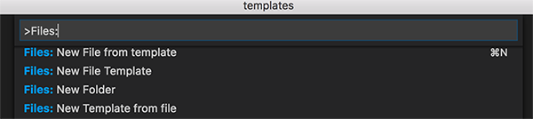
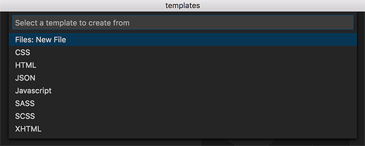

# Templates for VSCode

This extension helps in creating files easily from defined templates.
  

## Features

* Create new files from pre-defined templates.
* Create new File Templates either from a file or a blank template.
* Edit Templates.
* Add Author Name and Date of creation to the file. 

  
Choose commands from Command Palette:

   

Create a new File from Template:

   

## Usage

* Right-click on the VSCode Explorer where you want to create a new file, you will see an option 'Create New File from template'.
  Selecting this option shows a menu with existing templates. Select the desired template and enter the new file name. New file 
  will be created in the selected folder.

* You can also create a new File from template by Right-click on the editor. On Right-click in the editor, you will all also see 
  'Create Template from file' option. Select this option to create a new Template from the current active document.

* You can also do all these the other way by selecting the appropriate command from Command Palette. From Command Palette, select 
    'Files: New File from template'   -   to create a new file from template
    'Files: New File Template'        -   to create a new blank file template.
    'Files: New Template from file'   -   to create a new template from the current active file.
    'Files: Edit File Template'       -   to edit any existing template.

* Add Author name and Date of creation to the file, by adding `${AUTHOR}` and `${DATE}` tokens to your template. 

 

## Templates Location

* Depending on your OS, default templates are located at 

    * Windows : `%USERPROFILE%\.vscode\extensions\bam.vscode-file-templates-{VERSION}\templates`
    * Mac : `~/.vscode/extensions/bam.vscode-file-templates-{VERSION}/templates`
    * Linux : `~/.vscode/extensions/bam.vscode-file-templates-{VERSION}/templates`

* You can also create workspace specific templates. 
    Worspace templates are located at  `/%WORKSPACE_ROOT_FOLDER%/.vscode/templates`

 

## Extension Settings

This extension contributes the following settings:

* `templates.Author`: Set the Author name. This is used for the new files created.

 

## KeyBindings

* Create a New File from template

    Windows:  ` 'ctrl + n'`
    MAC: `'cmd + n'`

 

## Release Notes

### 1.0.0

Initial release of Templates for VSCode

### 1.0.1

* Throw warning if a file exists with the same name, when creating new file.  

-----------------------------------------------------------------------------------------------------------